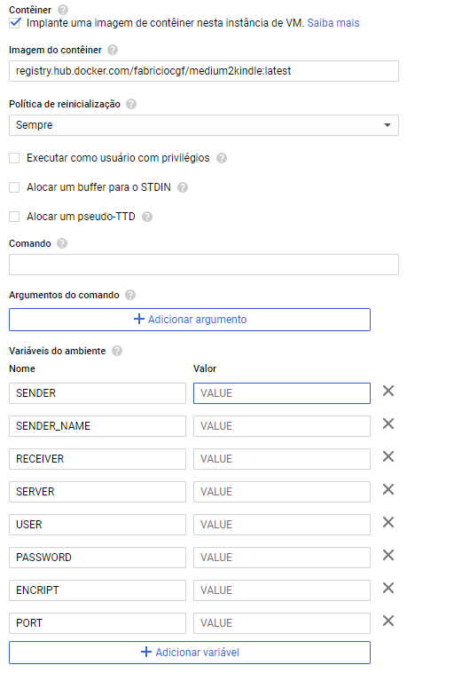

# Send your Medium articles to Kindle

You should deploy it using docker with the following environment variables:

```shell
SENDER=your@mail.com
SENDER_NAME=YourName
RECEIVER=YourKindleMail@kindle.com
SERVER=MailServer.com
USER=your@mail.com
PASSWORD=AppMailPsswd
ENCRIPT=SSL
PORT=YourMailPort
```

if running locally save your configuration to a .env file and run as follows:

```shell
docker pull fabriciocgf/medium2kindle
docker run --env-file=.env -d --name medium2kindle -p 80:80 fabriciocgf/medium2kindle
```

you can also run on a cloud provider, the configuration in Google Cloud is: 



the use consists on making a POST request with the header Content-Type as application/json and the following body:

```json
{
	"article_url": "https://www.youraticleurl.com"
}
```

